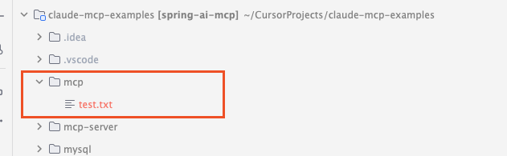

# 运行 McpClientJavaSdkExamples
 > Mac OS 操作系统下运行，如果你是windows操作系统，按照步骤自行安装。
 - npm install -g npx 
 - 如果出现 npm 不存在，则 brew install node

Q：出现如下错误

A：原因就是 npx 未安装或者 环境变量不存在，可以直接运行
npx -y @modelcontextprotocol/server-filesystem . 测试是否能运行。

## 运行结果

# 运行 McpWithChatApplication
大模型与 Mcp 结合使用，主要集成了两个 Mcp Server 

    - @modelcontextprotocol/server-filesystem 本地文件管理
    - @executeautomation/playwright-mcp-server 操作浏览器

在示例代码中支持 本地大模型和千问大模型

    - 本地大模型，需要自己安装 ollama 以及 qwen2.5:latest 
    - 使用阿里大模型平台，大家自行注册，修改 spring.ai.openai.api-key 即可
